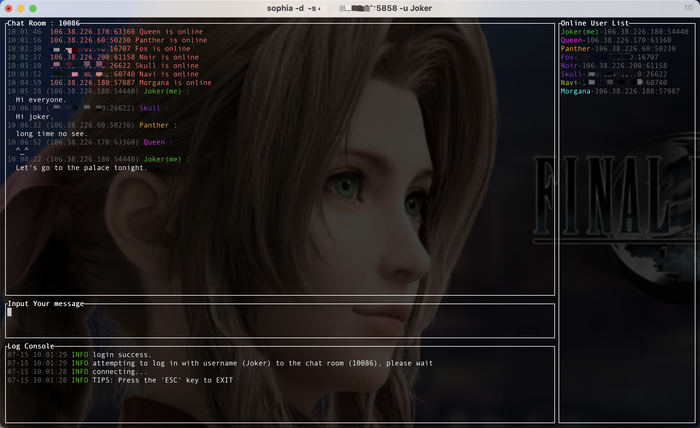

# ChatRoom

An online chat room based on QUIC protocol

# Getting Started

Run Server :

	cargo run --bin sophia-server
	// or custom args
	cargo run --bin sophia-server -- -a=0.0.0.0:5858 -c=./sophia-core/cert/cert.crt -k=./sophia-core/cert/cert.key

Run Client :
	
	cargo run --bin sophia // default is dark theme
	cargo run --bin sophia -- --theme light // use light theme
	// custom args
	cargo run --bin sophia -- -u tanshuo -p 666666 -c 10086 -d ./sophia-core/cert/cert.der -s localhost:5858 -t dark

Create your own custom certificate：

	openssl req -newkey rsa:2048 -new -nodes -x509 -days 3650 -subj "/CN=localhost" -keyout cert.key -out cert.crt -addext "subjectAltName = DNS:localhost, IP:127.0.0.1, IP:0.0.0.0"
	
	openssl x509 -outform der -in cert.pem -out cert.der

# Built using these great crates

* [quinn](https://github.com/quinn-rs/quinn)
* [tui-rs](https://github.com/fdehau/tui-rs)
* [clap](https://github.com/clap-rs/clap)
* [tokio](https://github.com/tokio-rs/tokio)
